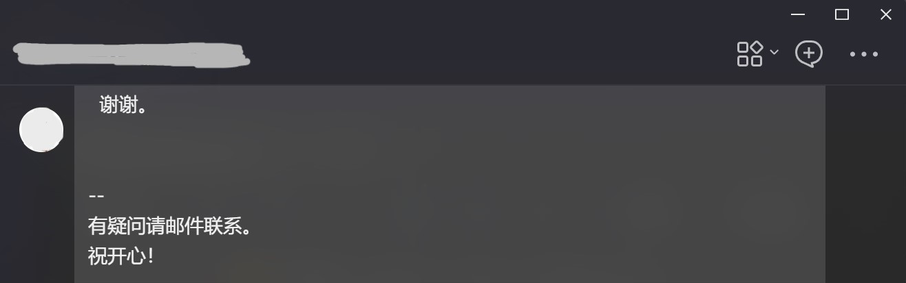
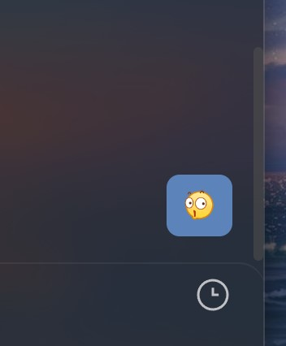
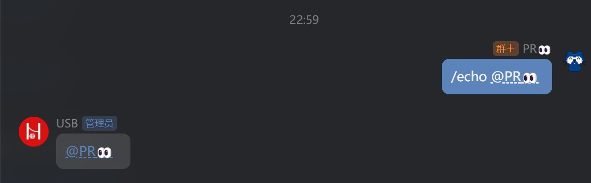
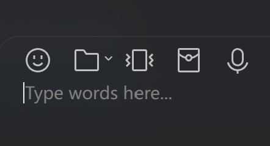
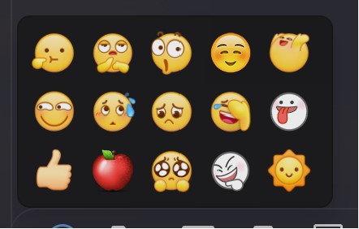

# Transitio-user-css

[Transitio](https://github.com/PRO-2684/transitio) user css 仓库。

## [all-in-one](./all-in-one.css)

大杂烩：包括以下除了 `demo-mode` 和 `hide-self` 外的所有样式。

## [avatar-float](./avatar-float.css)

头像浮动。

## [compact-at-list](./compact-at-list.css)

艾特建议面板更为紧凑。

## [demo-mode](./demo-mode.css)

演示模式，来源于 https://github.com/qianxuu/LiteLoaderQQNT-Plugin-Demo-mode 。

## [hide-items](./hide-items.css)

隐藏一些不需要的项目：

- 主页下侧侧栏的 QQ 邮箱
- 设置界面带 SVIP 的项目 (目前为超级调色盘)
- 主页上侧侧栏的无法隐藏的频道和游戏中心
- 聊天页面上侧的语音通话，视频通话，屏幕共享，机器人指令
- 输入框上侧的截图，语音按钮
- 菜单栏的检查更新
- 表情菜单的 GIF 热图
- 窗口控制栏的小面板按钮

若有需要，可以自行注释/删除掉相应代码。

## [hide-lock](./hide-lock.css)

隐藏侧边栏 "更多" 中倒数第四个按钮 ("锁定")，防止误触。(By @Shapaper233, [Ref](https://github.com/PRO-2684/transitio/issues/4#issuecomment-2119115010))

## [hide-self](./hide-self.css)

隐藏居右的自己的头像和昵称。

## [highlight-at](./highlight-at.css)

高亮艾特：将艾特显示为下划线，着色为主题色；修复选择 `<msg-at>` 元素的背景色

## [image-viewer](./image-viewer.css)

媒体查看器透明度修改。

## [input-placeholder](./input-placeholder.css)

添加输入框占位符（类似于 QA 的输入框提示）：`Type words here...`

## [link-color](./link-color.css)

链接动态颜色：悬浮/按下时显示相应颜色。

## [lite-tools-recall-enhancement](./lite-tools-recall-enhancement.css)

给 lite-tools 的撤回消息加上红色增强描边。(By @Shapaper233, [Ref](https://github.com/PRO-2684/transitio/issues/4#issuecomment-2119115010))

## [no-update-dialog](./no-update-dialog.css)

隐藏更新提示。

## [no-update-dot](./no-update-dot.css)

隐藏更新提示小红点。

## [qqface-fine-tune](./qqface-fine-tune.css)

QQ 表情微调：

- 使用系统 Emoji (与字体)。
- 调整最近表情和表情建议面板大小，更为紧凑。

## [transition](./transition.css)

添加过渡动画。

## [transparent](./transparent.css)

透明化部分元素。
