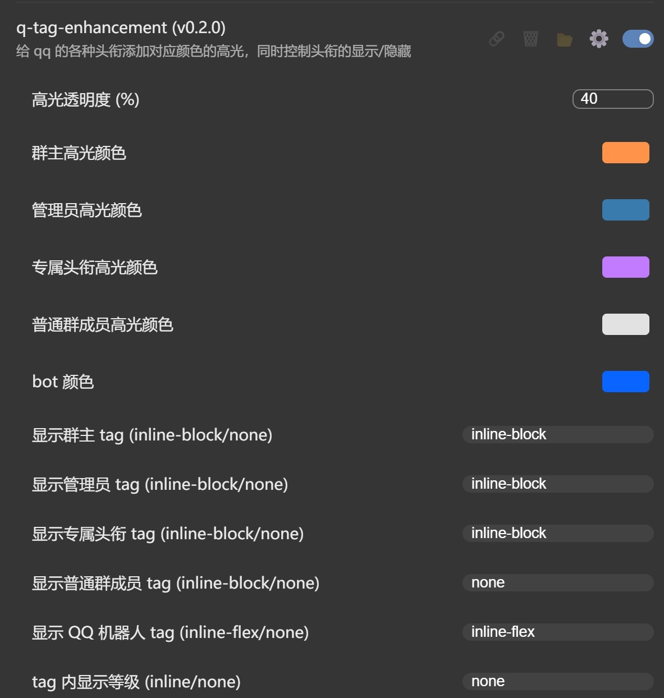

# Transitio-user-css

[Transitio](https://github.com/PRO-2684/transitio) user css 仓库。

## [avatar-float](./avatar-float.css)

头像浮动。

## [compact-at-list](./compact-at-list.css)

艾特建议面板更为紧凑。

## [customize-more-menu](./customize-more-menu.css)

自定义隐藏主界面更多菜单中至多三个不需要的项目，需自行设置要隐藏的项目序号 (默认设置的序号过大，故不会隐藏任何项目)。注意：数序号时需算上通过其它样式隐藏的项目。

## [demo-mode](./demo-mode.css)

演示模式，来源于 https://github.com/qianxuu/LiteLoaderQQNT-Plugin-Demo-mode 。

## [hide-emoticon-response](./hide-emoticon-response.css)

移除右键消息上的表情回应。(By [InfSein](https://github.com/InfSein), [Ref](https://github.com/PRO-2684/transitio/issues/4#issuecomment-2207904703))

## [hide-items](./hide-items.css)

隐藏一些不需要的项目：

- 主页下侧侧栏的 QQ 邮箱
- 设置界面带 SVIP 的项目 (目前为超级调色盘)
- 主页上侧侧栏的无法隐藏的频道和游戏中心
- 聊天页面上侧的语音通话，视频通话，屏幕共享，机器人指令
- 输入框上侧的截图，语音按钮
- 菜单栏的检查更新
- 表情菜单的 GIF 热图
- 窗口控制栏的小面板按钮
- 左上角的 QQ Logo

若有需要，可以自行注释/删除掉相应代码。

## [hide-lock](./hide-lock.css)

隐藏侧边栏 "更多" 中倒数第四个按钮 ("锁定")，防止误触。(By [@Shapaper233](https://github.com/Shapaper233), [Ref](https://github.com/PRO-2684/transitio/issues/4#issuecomment-2119115010))

****
**--->**

## [hide-self](./hide-self.css)

隐藏居右的自己的头像和昵称。(建议与 [`show-time.js`](https://github.com/PRO-2684/Scriptio-user-scripts/#show-time) 一起使用，替代 QQ 的消息时间显示)

## [highlight-at](./highlight-at.css)

高亮艾特：将艾特显示为下划线，着色为主题色；修复选择 `<msg-at>` 元素的背景色

## [image-viewer](./image-viewer.css)

媒体查看器透明度修改。可自定义透明度。

## [input-placeholder](./input-placeholder.css)

自定义输入框提示/占位符（类似于 QA 的输入框提示 `Type words here...`）

## [link-color](./link-color.css)

链接动态颜色：悬浮/按下时显示相应颜色。

## [lite-tools-recall-enhancement](./lite-tools-recall-enhancement.css)

给 lite-tools 的撤回消息加上红色增强描边。(By [@Shapaper233](https://github.com/Shapaper233), [Ref](https://github.com/PRO-2684/transitio/issues/4#issuecomment-2119115010))

包括但不限于自己的消息，群消息，私聊消息，撤回文件，撤回视频，撤回卡片等

**除红色描边外，字体颜色为lite-tools自带功能，在lite-tools插件设置中将撤回消息字体颜色调为红色即可达到图片效果**

## [no-update-dialog](./no-update-dialog.css)

隐藏更新提示。

## [no-update-dot](./no-update-dot.css)

隐藏更新提示小红点。

## [q-tag-enhancement](./q-tag-enhancement.css)

给 qq 的各种头衔添加对应颜色的高光，同时控制头衔的显示/隐藏。(By [@Shapaper233](https://github.com/Shapaper233), [Ref](https://github.com/PRO-2684/transitio/issues/4#issuecomment-2212343133), Co-authored by huoyan1231 & PRO-2684)

## [qqface-fine-tune](./qqface-fine-tune.css)

QQ 表情微调：

- 使用系统 Emoji (与字体)。
- 调整最近表情和表情建议面板大小，更为紧凑。

## [transition](./transition.css)

添加过渡动画。可自定义过渡时间。

## [transparent](./transparent.css)

透明化部分元素。可自定义透明度。

## [variable-fonts-fix](./variable-fonts-fix.css)

给可变字体添加一定的字宽，使用前请确保 litetools 自定义字体使用的是可变字体（可自助更改）。(By [@Shapaper233](https://github.com/Shapaper233), [Ref](https://github.com/PRO-2684/transitio/issues/4#issuecomment-2212343133))

## [vue-highlight](./vue-highlight.css)

高亮 Vue components，用于开发目的。
